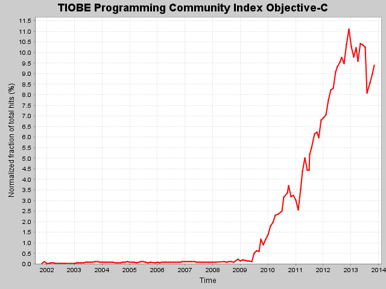
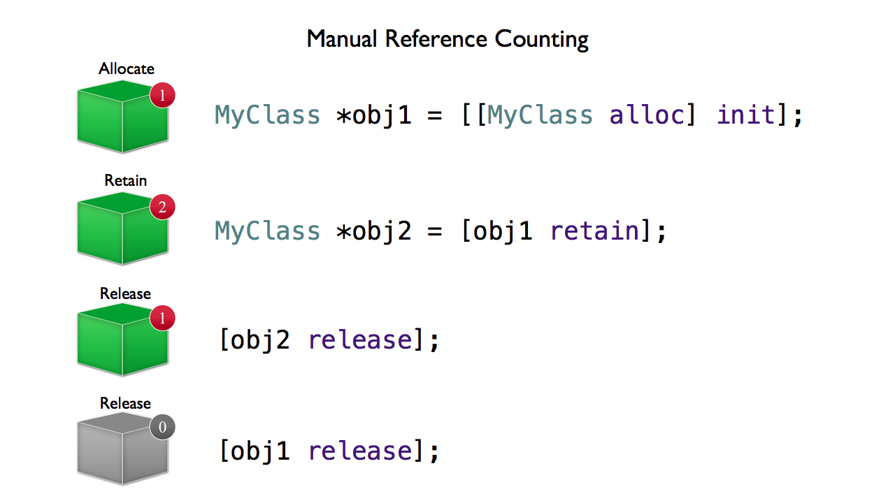

	#iOS-Workshop
## 2/12/2013 Hugo Tunius

---

#Agenda

* Om Objective-C
* Minneshantering
* xCode
* XCT
* Koda

---

#Om Objective-C

---

##Historia

* Brad Cox och Tom Love 1983 Stepstone
* NeXT licenserar språkt, Jobs gör entré
* NeXT uppköpt av Apple och används för att bygga Mac
* Notera att NS i foundation framework står för `NeXTSTEP`

---

##Rise to glory

Tredje största språket i världen

---

#Minneshantering

---

##Reference Counting

---

##Krånligt?
Det tyckte Apple också, därför tog de fram `ARC(Automatic Reference Counting)`

* **Strong** Ägandeskap. Ökar retain count
* **weak** Inget ägandeskap, assign.
* **Copy** Som strong fast med en ny kopia av objektet. Bör användas för till exmpel strängar

---

##Skillander mellan Objective-C och andra språk

* Protocols, nästan som Interfaces i Java
* Categories, monkey patching från ruby
* Nil pointer derferencing är lagligt
* Meddelanden

